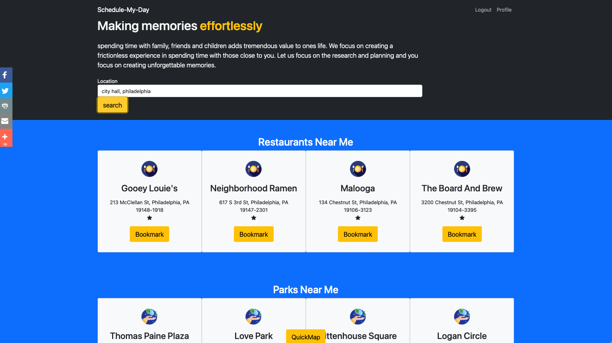
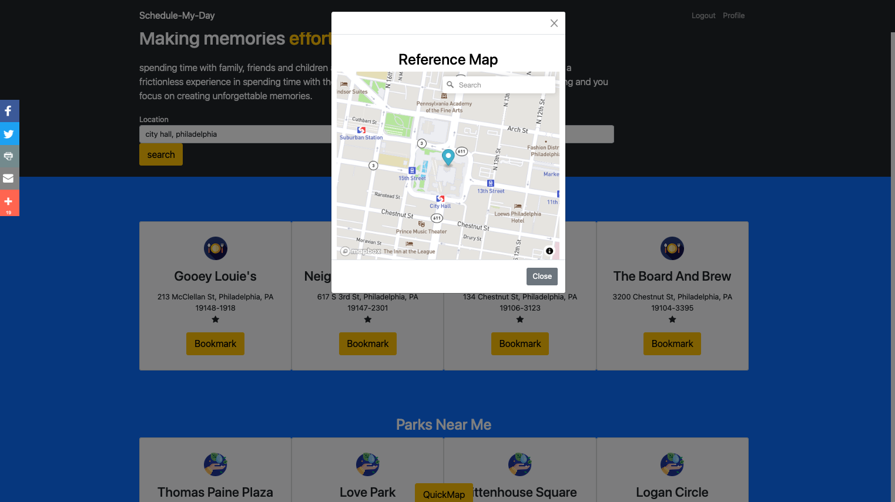
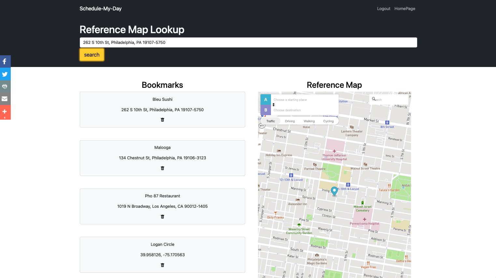

# My Awesome Project
This project is for creating a full-stack web application to be consumed by the public.
This web application allows you to use several API's together to gather local information for restaurants, parks, and weather forecast.
This application was designed easily having accessible information across many fields with one input.
What this application does is allow you to put in an address, and have API's return bookmarkable information to you!
additional features include a easily accessible interactive map using the quickmap feature.

**Link to project:**

## How It's Made:

**Tech used:** HTML, CSS, JavaScript, Express, Node.js, Boostrap, Passport, Mongoose, EJS, API's,  

Full CRUD functional application:

READ - after signing in the get request reads and renders our feed view using EJS as our view engine. The cards are placeholders for dynamically inserted information.

when clicking on the profile page link, a get request reads and renders our feed view using EJS as our view engine.

POST - A form triggers a post request which will save the user's bookmarked selection into a database. This happens when clicking the bookmark button. The information shown in the profile page is only from the current signed in user.

PUT - The put request will run when the heart icon is clicked. The heart icon will change a bookmarked background to a light red.

DELETE - the delete request deletes bookmarked content from our database. This is done with an event listener on the trash can icon on the profile page.

## Optimizations

## Lessons Learned:

- grabbing information from a single user and displaying it on a rendered view.

-when rendering pages, grabbing specific things in a collection to send to be rendered by ejs by filtering using mongoose function find and entering unique identifiers as the argument.

## Examples:

